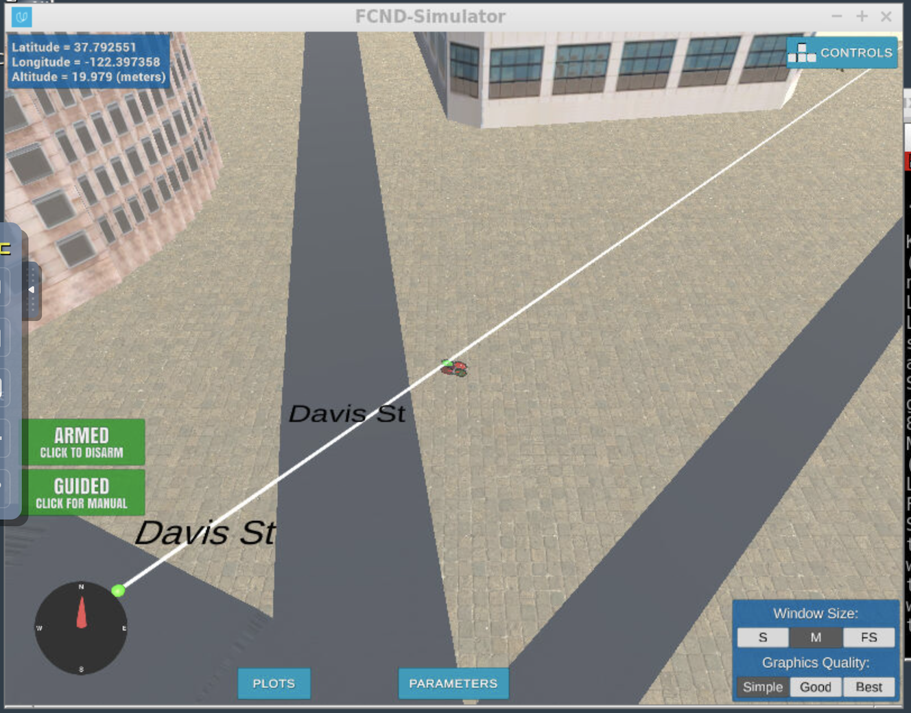

## Project: 3D Motion Planning

---

# Required Steps for a Passing Submission:
1. Load the 2.5D map in the colliders.csv file describing the environment.
2. Discretize the environment into a grid or graph representation.
3. Define the start and goal locations.
4. Perform a search using A* or other search algorithm.
5. Use a collinearity test or ray tracing method (like Bresenham) to remove unnecessary waypoints.
6. Return waypoints in local ECEF coordinates (format for `self.all_waypoints` is [N, E, altitude, heading], where the drone’s start location corresponds to [0, 0, 0, 0].
7. Write it up.
8. Congratulations!  Your Done!

## [Rubric](https://review.udacity.com/#!/rubrics/1534/view) Points
### Here I will consider the rubric points individually and describe how I addressed each point in my implementation.  

---
### Writeup / README

#### 1. Provide a Writeup / README that includes all the rubric points and how you addressed each one.  You can submit your writeup as markdown or pdf.  

You're reading it! Below I describe how I addressed each rubric point and where in my code each point is handled.

### Explain the Starter Code

#### 1. Explain the functionality of what's provided in `motion_planning.py` and `planning_utils.py`

'motion_planning.py' contains additional helper functions for grid generation and path planning (A* search, heuristic functions) contained in 'planning_utils.py'. I will first step through the changes in the main function and refer to the helper function as necessary.

1. The first change compared to the 'BackyardFlyer' class implementation in the previous project is the addition of a 'PLANNING' state to the drone. This allows for the drone to process its current position, goal position and plan a least cost path from its current position to goal position. This planning is contained within the new 'plan_path()' method in the 'MotionPlanning' class.

2. Overview of plan_path()
The plan_path() method is new to the MotionPlanning(drone) class. Unlike the BackyardFlyer class which executes a fixed path without knowledge of the map/surroundings, the drone needs to be able to plan and execute paths in the provided map of downtown San Francisco, successfully avoiding buildings and other obstacles. The method provides the general framework for the drone to perform following tasks:
- calculate current position of the drone
- accept a goal position for the drone
- use obstacle coordinate and dimension data in 2.5D format to create a grid that represents the map into free space, represented by '0', and obstacles, represented by '1'
- Plan the lowest cost path using a 2D A* algorithm and return waypoint coordinates for the drone to follow this path
- Prune the returned path to avoid multiple waypoints on the same line to make the flight more efficient

3. Overview of planning_utils()
planning_utils() provides the following main helper functions for the MotionPlanning(Drone) class :
- create_grid() : This function creates a 2.5D discretization of the map using the obstacle data provided in 'colliders.csv'. A 2D grid is very efficient for planning the drone path. It forgoes complexity involved with 3D geometries of the obstacles, and simply calculates a value of 0 or 1 for grid nodes which are contained within a boundary(given by 'SAFE_DISTANCE') around any obstacle  that is taller than the target altitude('TARGET_ALTITUDE') of the drone.
- a_star() : This is an implementation of the A* star search algorithm that was discussed in class. It looks at the current position of the drone in the grid and traces the shortest cost path to the goal considering all available actions for the drone (in the starter code, diagonal movements in the grid are not implemented). The grid generated using create_grid() is useful here since it has obstacle information in it that helps the A* algorithm plan a path around them.

And here's a lovely image of my results (ok this image has nothing to do with it, but it's a nice example of how to include images in your writeup!)

Here's | A | Snappy | Table
--- | --- | --- | ---
1 | `highlight` | **bold** | 7.41
2 | a | b | c
3 | *italic* | text | 403
4 | 2 | 3 | abcd

### Implementing Your Path Planning Algorithm

#### 1. Set your global home position
The first line of 'colliders.csv' provides the latitude and longitude of the center of the map, which we want to set as the global home position for the drone. All obstacle coordinates are provided with respect to this global home position. To extract this information from 'colliders.csv', I used a number of file object functions provided in Python.
- f.readline() to read the first line of the file 
- f.rstrip() to remove any whitespaces from the right of the line
- Regular expression to return the numerical values of latitude and longitude as list of strings
- Converting the strings to float values for latitude and longitude

The latitude and longitude is set as the home position of the drone class object using the function 'set_home_position'.

#### 2. Set your current local position
The current position of the drone in geodetic coordinates is stored in the global_position() function in 'drone.py' as an array containing the longitude, latitude and altitude of the drone. This is passed onto 'current_global_pos'. 
The global_to_local() function in 'frame_utils.py' is used to convert current_global_pos to local position relative to previously set home_position. The function uses the current global position and the global home as inputs and uses the Python utm library for conversion from lat/lon to nothing/easting.

#### 3. Set grid start position from local position
Now that we have the local position of the drone in the previous step, we want to set this position as the grid start position. When we generate a grid for the map, we want to discretize the entire map into grid cells starting from the lower bottom corner in the map as the origin (-north_min, -east_min) to the upper top corner (+north_max, +east_max). These points are defined with respect to the origin (0,0) provided as the map center. north_min, east_min, north_max, east_max are calculated from 'colliders.csv' as the extents of the map using obstacle coordinates, obstacle size and safe flying distance. 

To set the grid start position to the local position of the drone, we add the local position to the grid origin hence getting the following. The coordinates are rounded off to the nearest grid node by using integer value since each grid cell is 1m x 1m.
grid_start = (-int(north_min) + int(self.local_position[0]), -int(east_min) + int(self.local_position[1]))

#### 4. Set grid goal position from geodetic coords
The user should enter the desired goal longitude and latitude into the variables goal_lon, goal_lat and goal_alt. In my implementation, I use these values and convert them to the local frame using the global_to_local() function in 'frame_utils.py'. The grid_goal position is then obtained by offseting for grid origin as previously done with grid_start.

To obtain grid goal positions to test, I used the latitude and longitude positions provided in the motion planning simulator by flying to a desired position in the map, and then resetting the simulator with these updated goal coordinates.

#### 5. Modify A* to include diagonal motion (or replace A* altogether)
Grid-based implementation:
The started code provides an implementation of A* which considers north, east, south and west moves only. To add diagonal capability, I added north_east, north_west, south_east and south_west directions to the 'Action' object as available actions to the drone. The cost of a diagonal move is set to sqrt(2) to account for the additional distance the drone has to travel to get to a diagonal position. 
This also requires adding conditionals to the valid_actioins() function which evaluates if the moves or actions in Action(Enum) are valid depending on obstacles in the grid, map boundaries, etc.

Adding diagonal movements makes the grid search more efficient and lower cost. Below is a screenshot of the same path traced with diagonal movements off in the first image and with diagonal movements enabled in the next picture.

The A* algorithm returns the lowest cost path as a set of waypoint starting from the grid_start position to the grid_goal position, if a path can be found. 

#### 6. Cull waypoints 
The A* algorithm provides a set of waypoints to the drone. These waypoints are spaced either 1m or 1.414m apart depending on if the path is along a solid direction or a diagonal. This can result in several waypoints being along a straight line in a particular direction which the drone will try to fly to and stop. To make the path more efficient, we want to get rid of intermediate waypoints using a collinearity test or Bresenham's line tracing algorithm.

Collinearity test:
Three points are collinear if the area of the triangle obtained by joining these three points is 0 or more practically, below a reasonable threshold value. The collinearity check for three points is defined in collinearity_check() in planning_utils.py. The points p1,p2 and p3 are cast into a 3x3 matrix adding a column of 1s. The determinant of this matrix is the area of the triangle formed by joining the three points and is calculated using np.linalg.det() and compared to a threshold epsilon. The threshold is set to 1e-6. If the determinant is below this threshold, the points p1,p2 and p3 are determined to be collinear.

In the prune_path() function, all waypoints returned from the A* are checked for collinearity in sets of three starting with the first three points. If the points are found to be collinear, the middle point is removed. Progressing through all waypoints this way only leaves with the first and last coordinate along any straight line in any direction along the path. The pruned path is returned to the motion_planning class.

Below images show an example path with and without pruning

Bresenham's line tracing algorithm:
Even though collinearity test works in order to reduce waypoints significantly and making the drone path smoother, it has some shortcomings. In the grid based discretization method, the drone can move in one of 8 directions. Collinearity tests can work in pruning paths along one of these 8 directions. For arbitrary directions however, using the Bresenham's algorithm to prune is more effective. 

In the bresenham_prune_path() function, all waypoints returned from the A* are considered in sets of three again. For a set of three consecutive waypoints p1,p2,p3, if the line joining p1 and p3 does not hit an obstacle, the intermediate point is removed. The Python 'bresenham' library is used to return coordinates of all grid points along the line joining p1,p3. These grid points are checked against our grid to determine if any of them lie on obstacles. If not, p2 is safe to remove from the waypoint list. The Bresenham implementation gives more freedom in the drone's movement.

Below is a comparison of the paths obtained without any pruning, pruning with collinearity check and finally pruning with Bresenham's algorithm. The number of waypoints for each approach are shown in the table below.

**Pruning method** | **# of waypoints** | **Distance covered per waypoint**
--- | --- | ---
None | 359 | 1.01
Collinearity | 43 | 8.46
Bresenham | 8 | 45.5

### Execute the flight
#### 1. Does it work?
For my implementation, I am using a 20m target_altitude and a 5m safety distance to avoid collisions. I also modified the code to be able to land or take off from buildings below the target_altitude of the drone. Below is an example of my execution process.

-Step 1: fly to a desired goal location manually. Note the longitude, latitude of this position and hard-code these in motion_planning.py.
-Step 2: Restart the simulator. Fly to the desired start position.
-Step 3: Run motion_planning.py and see the drone fly!

In my final implementation, I have used a grid based approach. I found this to be faster than a graph based approach. I use a modified A* approach that includes diagonal movements in the grid to make the algorithm more efficient. I use Bresenham's line tracing to prune the path generated from A* search. The code can be tested by setting goal_lat = 37.795890, goal_lon = -122.396510, goal_height = 0.0 to fly the drone near the intersection of Davis and Clay.

I also modified the code to be able to land on buildings that have a maximum height that is lower than the drone target altitude. This can be tested by setting goal_lat = 37.794520, goal_lon = -122.396646, goal_height = 3.000

### Double check that you've met specifications for each of the [rubric](https://review.udacity.com/#!/rubrics/1534/view) points.
  

